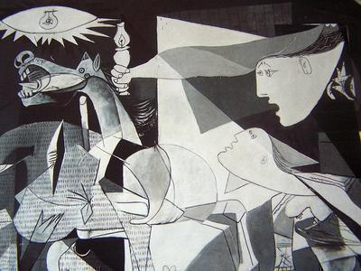

# Neural-Style
Nueral Style Transfer using Tensorflow.
Neural Transfer involves reproducing the contents of an input image with the artistic style of a style image.
<table>
<tr>
<th>Content Image</th>
<th>Style Image</th>
</tr>
<tr> 
<th></th>
<th></th>
</tr>
<tr>
<th>Output Image</th>
</tr>
<tr>
<th align="center">
  
</th>
</tr>
</table>

## Basic Theory

Two distances, one for the content (DC) and one for the style (DS) are defined. 
They measure how different two images are content-wise and stylistically.

A third image, called the input image, 
which can be white noise or the content image itself is then 
transformed so that its content-distance with the content-image 
and its style-distance with the style-image are both minimized.
